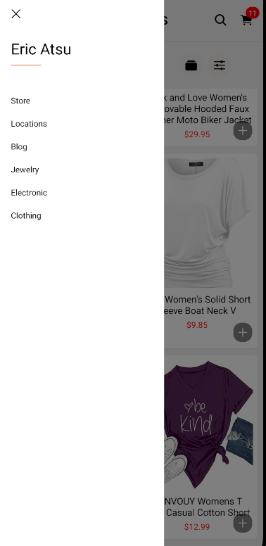

Certainly! Here's the updated README with placeholders for screenshots:

---

# E-Shop App

This project is an e-commerce mobile application built with React Native. It allows users to view a list of available products, preview detailed information about each product, add products to their cart, and remove products from their cart. The cart items are stored locally on the device.

## Features

- **HomeScreen:** Displays a list of available products.
- **ProductDetailScreen:** Displays detailed information about a selected product.
- **CartScreen:** Displays selected items in the cart.
- **Drawer Navigation:** Accessible through a swipe gesture or button, providing easy navigation.
- **Add to Cart Button:** Allows users to add products to their cart.
- **Remove from Cart Button:** Allows users to remove products from their cart.
- **Fetch Data from External API:** Product data is fetched from an external API using fetch or axios.
- **Asynchronous Operations:** Managed with async/await or promises.
- **Local Storage:** Selected items are stored locally using AsyncStorage, SecureStore, or FileSystem.

## Components

### HomeScreen

The `HomeScreen` component displays a list of products fetched from an external API. Each product has an "Add to Cart" button.


### ProductDetailScreen

The `ProductDetailScreen` component displays detailed information about a selected product, including its name, description, price, and an "Add to Cart" button.


### CartScreen

The `CartScreen` component displays the items added to the cart. Each item in the cart has a "Remove from Cart" button.


### Drawer Navigation

The drawer navigation allows users to easily navigate between the `HomeScreen`, `ProductDetailScreen`, and `CartScreen`. It can be accessed through a swipe gesture or a button.



## Functionality

- **View Product List:** Users can view a list of available products fetched from an external API.
- **View Product Details:** Users can preview detailed information about a product by navigating to the `ProductDetailScreen`.
- **Add to Cart:** Users can add products to their cart by clicking the "Add to Cart" button.
- **Remove from Cart:** Users can remove products from their cart by clicking the "Remove from Cart" button.
- **View Cart Items:** Users can view the items in their cart by navigating to the `CartScreen`.

## Implementation

### Fetching Data

Data is fetched from an external API using `fetch` or `axios`. The following is an example of how to fetch data using `axios`:

```javascript
import axios from 'axios';

const fetchProducts = async () => {
  try {
    const response = await axios.get('https://api.example.com/products');
    return response.data;
  } catch (error) {
    console.error('Error fetching products:', error);
    throw error;
  }
};
```

### Managing Asynchronous Operations

Asynchronous operations are managed using `async/await`:

```javascript
const getProducts = async () => {
  try {
    const products = await fetchProducts();
    setProducts(products);
  } catch (error) {
    console.error('Error getting products:', error);
  }
};
```

### Local Storage

Local storage is managed using AsyncStorage:

```javascript
import AsyncStorage from '@react-native-async-storage/async-storage';

const storeCartItems = async (items) => {
  try {
    const jsonValue = JSON.stringify(items);
    await AsyncStorage.setItem('@cart_items', jsonValue);
  } catch (error) {
    console.error('Error storing cart items:', error);
  }
};

const getCartItems = async () => {
  try {
    const jsonValue = await AsyncStorage.getItem('@cart_items');
    return jsonValue != null ? JSON.parse(jsonValue) : [];
  } catch (error) {
    console.error('Error getting cart items:', error);
    return [];
  }
};
```

## Running the App

To run the app, follow these steps:

1. Clone the repository.
2. Install dependencies: `npm install`.
3. Start the development server: `npm start`.
4. Run the app on your emulator or physical device.

## Conclusion

This e-commerce app provides a complete shopping experience with the ability to view products, see detailed product information, add products to a cart, and view and remove items from the cart. Local storage ensures that cart items persist between sessions.

For any questions or further assistance, please refer to the code comments and documentation.

---
